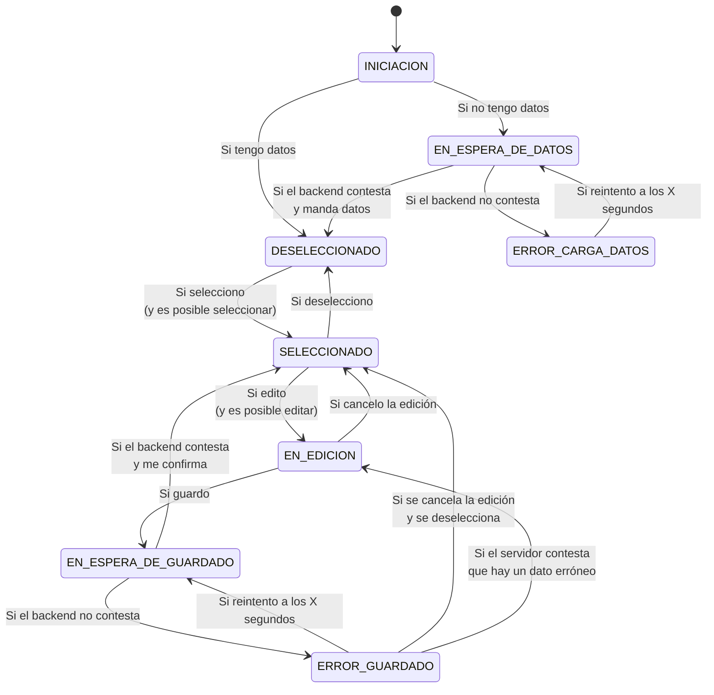

# Listado de Personas editable

```html
<listado-personas....>
```
## Componente Persona

```html
<persona 
    id="192938392" \
    datos="MODELO" / O me daban una o me daban la otra. En ocasiones lo único que tendrá quien use este componente es el id de la persona y el resto de datos los tendré (YO COMPONENTE) que pedir al servidor. En otras ocasiones me pasaban el modelo completo de la persona y yo solo lo muestro.
    modo="compacto|extensible|extendido" 
    modoInicial="compacto|extendido"
    editable="true" 
    seleccionable="true" 
    seleccionado="true" 
    estiloBase="css_class"

    onSeleccionado="llamar a una función que haga algo"
    onDeseleccionado="llamar a una función que haga algo"
    onEdicion="llamar a una función que haga algo"
    onEdicionFinalizada="llamar a una función que haga algo"
    onEdicionCancelada="llamar a una función que haga algo"
/>
```

## A nivel del archivo persona.component.ts qué variables me interesa definir

Qué datos necesito controlar en cada momento de cada componente persona?

- ~~enEdicion:boolean~~
- ~~estoySeleccionado:boolean~~

- estado: 1|2|3
- estoyCompacto: boolean

### MAQUINA DE ESTADOS asociada al componente

ESTADOS:


INICIAL ---> (si ya tengo los datos) --->   DESELECCIONADO
    |                                             ^
    +------> (si no tengo los datos) --->   EN_ESPERA_DE_DATOS_DEL_SERVICIO
                                                  v            ^ (relanzar la petición cada X tiempo)
                                            ERROR_COMUNICACION_SERVIDOR_AL_CARGAR


                                +---------- ERROR_COMUNICACION_SERVIDOR_AL_GUARDAR (intentar relanzar el proceso de guardar)
                                |                   ^   v
                                |                   ^   v
                                |           EN_ESPERA_DE_OK_DE_GUARDADO 4
        1                    2  v                 3  ^
   DESELECCIONADO <---> SELECCIONADO <---> EN EDICION
       ^                                      |
       |                                      |
       +--------------------------------------+


    Si meto como teléfono: FEDERICO
    En el front meteré una validación de cortesía
    En el back harán la misma validación que yo? O NO... Siempre una mejor ... al menos igual
        Ese teléfono ya existe en la BBDD. No cuela


TRANSICIONES: (a su vez corresponden con acciones que voy a realizar) <---- SEA UNA FUNCION EN EL TS.
                                        EVENTO(OUTPUT)
    1 -> 2: Seleccionar la persona                  onSeleccionado
              GUARDA: solo si seleccionable=true
    2 -> 1: Deseleccionar la persona                onDeseleccionado
    2 -> 3: Iniciar la Editar la persona            onEdicion
              GUARDA: solo si editable=true
    3 -> 4: Finalizar la edición bien               onEdicionFinalizada
    3 -> 2: Cancelar la edición                     onEdicionCancelada
    3 -> 1: Finalizar la edición y deseleccionar    onEdicionFinalizada y onDeseleccionado

   Pregunta... se debe cumplir alguna condición para poder ejecutar la transición 1->2? GUARDA

<button onClick="llamar a una función que guarde!">Guardar</button>

App de solicitud de vacaciones:

En la ficha de una solicitud de vacaciones:
- Solicitante
- Aprobador
- Usuario conectado actualmente

    SOLICITANTE:

    +--------+--------------------------+
    |        |                          |
    | O   O  | Nombre: Felipe           |
    |   o    | Email:                   |
    |  ____  | Teléfono: 948783494      |
    |        |                          |
    +--------+--------------------------+

<persona atts>
    vvvv

```html
<div id="persona" class="extendido">
    
    <div id="nombre">Felipe Ruiz</div>
    <div id="email">felipe.ruiz@correo.es</div>
    <div id="telefono">948783494</div>
</div>


<div id="persona" class="compacto">
    
    <div id="nombre">Felipe Ruiz</div>
</div>

```


    APROBADOR:

    +--------+--------------------------+
    |        |                          |
    | O   O  | Nombre:                  |
    |   o    | Email:                   |
    |  ____  | Teléfono:                |
    |        |                          |
    +--------+--------------------------+


App de gestión de expedientes de algo...
- Creador del expediente
- RevisoreS del expediente

    +--------+--------------------------+
    |        |                          |
    | O   O  | Nombre:                  |
    |   o    | Email:                   |
    |  ____  | Teléfono:                |
    |        |                          |
    +--------+--------------------------+


    +--------------------------+---+
    | 😀  Federico Ruiz        | V |
    +--------------------------+---+


    Creador del expediente                                  Revisores del expediente
    +--------------------------+---+                        +------------------------------+
    | 😀  Federico Ruiz        | V |                        | 😀  Menchu Ruiz              |
    +--------------------------+---+                        +------------------------------+  
                                                            | 😐  Luis Ruiz                |
                                                            +------------------------------+
                                                            | 🙁  Fermín Ruiz              |
                                                            +------------------------------+
                                                          [Seleccionar todos] [Borrar] [Recordar]

<persona id="19019812823"/> <!-- en este caso, quiero que el componente solicite los datos de la persona al backend (servicio mediante)-->

<expediente id="123456789"></expediente> <!-- en este caso, quiero que el componente solicite los datos del expediente al backend (servicio mediante). Este componente recibe los datos del expediente.. entre los que se encuentran los datos de la personas creadora y los revisores 

Pero quizas ese componente... en su html (el del componente expediente)
```html
<h2>
    Creador:
</h2>
<persona datos="DATOS_DEL_CREADOR_YA_RECIBIDOS_DEL_BACKEND"></persona>
<h2>
    Revisores:
</h2>
<ul>
    <persona datos="DATOS_DEL_REVISOR1_YA_RECIBIDOS_DEL_BACKEND"></persona>
    <persona datos="DATOS_DEL_REVISOR2_YA_RECIBIDOS_DEL_BACKEND"></persona>
    <persona datos="DATOS_DEL_REVISOR3_YA_RECIBIDOS_DEL_BACKEND"></persona>
</ul>
```
---

# POR DONDE SIGO?

- [ ] Definir el modelo de persona de frontal
- [ ] Definir el modelo de persona de backend
- [ ] Crear el servicio de personas para que trabaje con el backend
- [ ] Añadir datos falsos de personas a json-server

- [x] Crear un css
- [ ] Mejorar el html
- [ ] Definir la lógica del componente

---

--------FRONTEND---------------    -----------------------BACKEND--------------------------------
FORMULARIO
componente WEB  ---> Servicio -----> ControladorRESTv1 ---> Servicio   ---> Repositorio   ----> BBDD
  ^^^                 ^^^^                  ^^^^                ^^^^            ^^^^^           ^^^
  Captura           Comunicar con      Expone un servicio       Define         Gestionar la    Garantizar la 
  de datos          back               mediante un              Logica         persistencia    integridad de los datos
                                       servicio               de negocio
 ^
Validación de                                                   Validación de                   Validación obligatoria!
cortesía                                                        cortesía


@Component          @Injectable       @RestController         @Service        @Repository

Captura un DNI
Fecha de nacimiento
   10-10-1980
   10-10-2038

REQUISITO: Si solo tuviera un sitio donde validar el DNI: BBDD


        GUARDA: extendible
   +-----extender-----+
   |                  v
compacto           extendido
   ^                  |
   +-----compactar----+
        GUARDA: extendible

Esta máquina de estados es PARALELA a la otra máquina de estados.
Yo puedo estar seleccionado o no , edición o no ... en espera de dato o no...
Y CON INDEPENDENCIA puedo estar: Compacto o extendido

Esta máquina de estados tiene 2 estados.
2 transiciones... de a a b y viceversa... con exactamente las mismas guardas.
Voy a montar el mismo pifostio que arriba para controlar el estado de esta máquina de estados.
EN ESTE CASO, meto una variable BOOLEANA y punto.


----


```java
// DIA 1
// DIA 101 y quiero hacer que la edad no pueda ser negativa
public class Persona {
    private String id;
    private String nombre;
    private String foto;
    private int edad;

    // Método para establecer la edad
    public void setEdad(int edad) {
        if (edad < 0) {
            throw new IllegalArgumentException("La edad no puede ser negativa");
        }
        this.edad = edad;
    }

    // Método para obtener la edad
    public int getEdad() {
        return edad;
    }

    // Otros métodos y atributos de la clase
    // getters y setters
    public String getId() {
        return id;
    }
    public void setId(String id) {
        this.id = id;
    }
    public String getNombre() {
        return nombre;
    }
    public void setNombre(String nombre) {
        this.nombre = nombre;
    }
    public String getFoto() {
        return foto;
    }
    public void setFoto(String foto) {
        this.foto = foto;
    }


}
// ESTO ES JAVA ES UNA MIERDA ENORME !!! ME ECHAN !
// DIA 2-100 la gente empieza a usar mi clase
Persona p=new Persona();
p.setId("192938392");
p.setNombre("Federico Ruiz");
p.setFoto("https://www.gravatar.com/avatar/192938392");
p.setEdad(43); // Esto es un error de programación, no debería poderse hacer

System.out.println(p.getId());
System.out.println(p.getNombre());
System.out.println(p.getFoto());
System.out.println(p.getEdad());
// DIA 102... 1 millón de personas kalasnikov en mano buscándome .. su código ni compila.
```
Los getters y setters de JAVA NO SON PARA ENCAPSULA.. ni para acceder a los datos ni nada der eso.
SIMPLEMENTE ESTAN AHI PARA FACILITAR EL MNTO DEL CODIGO
Y SE DEBE A LA MALA SINTAXIS QUE TIENE JAVA

```ts
export class Persona {
    id: string;
    nombre: string;
    foto: string;
    private _edad: number;

    get edad(): number {
        return this._edad;
    }

    set edad(value: number) {
        if (value < 0) {
            throw new Error("La edad no puede ser negativa");
        }
        this._edad = value;
    }
}
// ESTO ES LO NORMAL EN TS
const p: Persona = new Persona();
p.id = "192938392";
p.nombre = "Federico Ruiz";
p.foto = "https://www.gravatar.com/avatar/192938392";
p.edad = 43;

console.log(p.id);
console.log(p.nombre);
console.log(p.foto);
console.log(p.edad);
```

